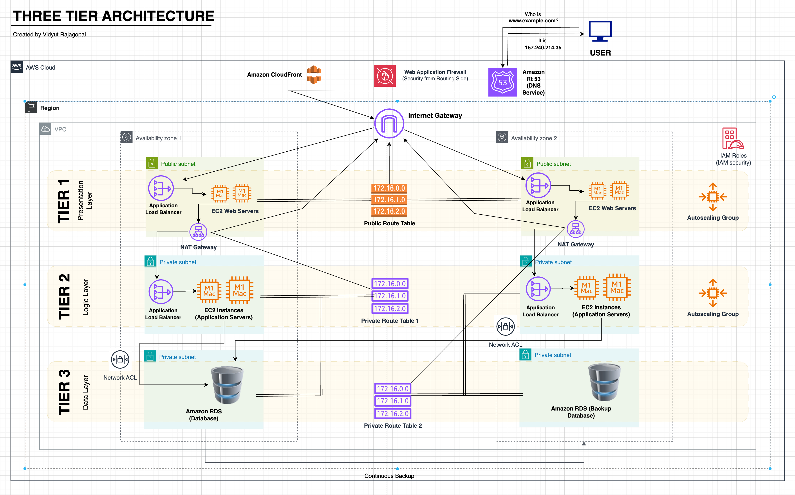

# 🛡️ Zero-Day Architecture Auditor

An AI-powered DevSecOps tool that visually parses cloud architecture diagrams, cross-references them with active threat intelligence (CVEs), and automatically generates the Terraform Infrastructure-as-Code (IaC) required to patch identified vulnerabilities.

## 📌 Executive Summary
In modern DevSecOps, the architectural security review is a massive bottleneck. Security engineers spend days manually hunting for flaws in proposed cloud infrastructure (like unencrypted internal transit or over-provisioned IAM roles). 

This tool shifts security completely left. By leveraging **Multimodal AI (Gemini 2.5 Flash)**, the Auditor reduces a multi-day compliance review into a 30-second automated check, translating visual architectural flaws directly into deployable Terraform remediation code.

---

## 🚀 Features
* **Visual Topology Parsing:** Upload any cloud diagram (AWS, Azure, GCP) or whiteboard sketch. The AI maps the network components and data flow entirely from the image.
* **Live Threat Intelligence Integration:** Ingests the latest cloud-specific CVEs and security threats to prioritize the audit against active, real-world attack vectors.
* **Automated IaC Generation:** Does not just flag issues—it solves them. Generates exact, production-ready Terraform blocks (e.g., `aws_lb_target_group` for HTTPS enforcement, `aws_s3_bucket_public_access_block`) to patch the top critical vulnerabilities found in the diagram.
* **Human-in-the-Loop Design:** Outputs clean Markdown reports for security teams to review before applying the Terraform code to production environments.

## 🛠️ Tech Stack
* **Frontend:** Streamlit (Python)
* **AI Engine:** Google Gemini 2.5 Flash (Multimodal Vision)
* **Infrastructure:** Terraform (IaC Output)
* **Libraries:** Pillow (Image Processing), python-dotenv (Secrets Management)

---

## ⚙️ Installation & Usage

### Clone the Repository
```bash
git clone [https://github.com/bhavana2498/zero-day-architecture-auditor.git](https://github.com/YourUsername/zero-day-architecture-auditor.git)
cd zero-day-architecture-auditor

## 📊 Demo
To see the Auditor in action, you can use the sample diagram provided in the `/examples` folder.

**Input Diagram:**


### 📊 Results
When the auditor processes the architecture diagram, it identifies vulnerabilities and generates a remediation plan.

**Output Report:**


---

> 💡 **DISCLAIMER**: This repository is a proof-of-concept built to demonstrate the integration of Multimodal AI (Gemini 2.5 Flash) into DevSecOps pipelines. It is intended for educational purposes only.